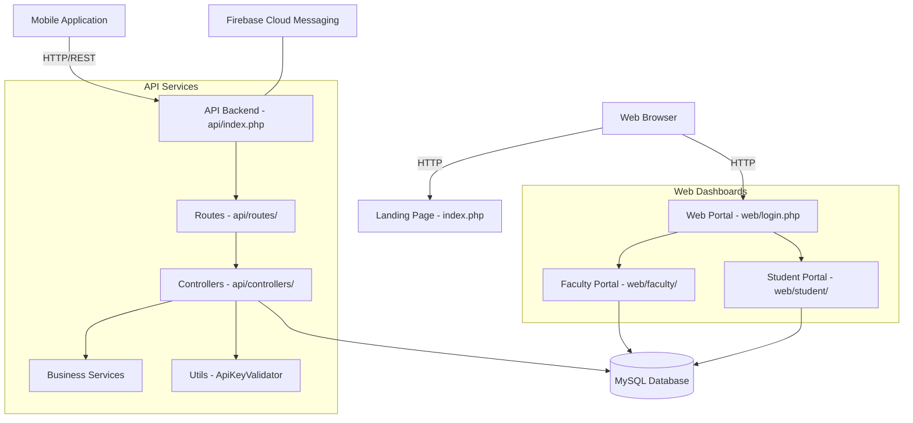

# ICT Department Portal

## Overview

The **ICT Department Portal** is a comprehensive, responsive web-based platform built with PHP and MySQL. It is designed to manage academic activities, showcase department information, and provide robust management interfaces for students and faculty members. 

The system is composed of:
1. **Public Landing Page**: A visually appealing, responsive homepage designed with Tailwind CSS, displaying department details, courses, and student projects.
2. **Web Dashboards**: Dedicated portals for faculty and students (`web/`) to manage attendance, exams, leaves, and feedback.
3. **RESTful API**: A powerful backend (`api/`) that serves data for web clients and potential mobile applications. It includes secure endpoints with API key validation and JWT authentication.

---

## Architecture Diagram



---

## Features

- **Dynamic Landing Page**: Interactive UI with smooth scrolling, animations, and project video embedding (YouTube integration).
- **Faculty Portal**: Administrative tools to manage students, input attendance, upload results, and manage leave requests.
- **Student Portal**: Interfaces for students to check grades, track attendance, view announcements, and participate in campus activities.
- **Robust API System**: Structured modular routing (e.g., AppVersion, Faculty, Student, Placements, Exams, Holidays).
- **Data Import/Export**: Built-in support for processing Excel sheets using `PhpSpreadsheet`.
- **Firebase Integration**: Capability for push notifications using `kreait/firebase-php`.

---

## Directory Structure

```text
ict-server-testing/
├── Dockerfile                  # Docker configuration for Apache & PHP 8.3
├── index.php                   # Main landing page for the ICT Department
├── README.md                   # Project documentation (this file)
│
├── api/                        # RESTful API Backend
│   ├── composer.json           # API dependencies (Firebase, JWT)
│   ├── index.php               # API entry point & central router
│   ├── controllers/            # Endpoint logic and database interactions
│   ├── db/                     # Database connection configuration
│   ├── notifications/          # Firebase push notifications handling
│   ├── routes/                 # Routing definitions for specific resources
│   ├── services/               # Reusable business logic
│   └── utils/                  # Helper utilities (e.g., ApiKeyValidator.php)
│
└── web/                        # Web Dashboards & Authentication
    ├── composer.json           # Web dependencies (PhpSpreadsheet, JWT)
    ├── login.php               # Central login gateway for the portals
    ├── logout.php              # Session termination script
    ├── assets/                 # CSS, JavaScript, and Images (e.g., logos)
    ├── faculty/                # Scripts and views for the Faculty dashboard
    └── student/                # Scripts and views for the Student dashboard
```

---

## Technologies Used

- **Backend Logic**: PHP 8.3
- **Web Server**: Apache
- **Database**: MySQL (using `mysqli` and `pdo_mysql` extensions)
- **Frontend**: HTML5, Tailwind CSS, FontAwesome, JavaScript
- **Libraries/Packages**: 
  - `kreait/firebase-php` (Firebase Integration)
  - `firebase/php-jwt` (Secure Authentication Tokens)
  - `phpoffice/phpspreadsheet` (Excel processing capabilities)

---

## Installation & Setup

### Prerequisites
- **Docker & Docker Compose** (Recommended) 
- OR a Local Web Server (XAMPP/WAMP/LAMP stack) with **PHP 8.3** and **MySQL**.
- **Composer** (PHP dependency manager)

### Method 1: Using Docker (Recommended)

1. **Clone the repository:**
   ```bash
   git clone <repository_url> ict-portal
   cd ict-portal
   ```

2. **Build the Docker image:**
   The included `Dockerfile` will install PHP 8.3, Apache, and the required MySQL extensions.
   ```bash
   docker build -t ict-portal .
   ```

3. **Run the container:**
   ```bash
   docker run -p 8080:80 -d ict-portal
   ```

4. **Access the Application:**
   Open a web browser and navigate to `http://localhost:8080/`.

### Method 2: Manual Setup (XAMPP/WAMP)

1. **Clone the repository** to your web server's document root (e.g., `htdocs` or `/var/www/html`).

2. **Install Composer Dependencies:**
   You need to install dependencies in both the `api` and `web` directories.
   ```bash
   cd api
   composer install
   cd ../web
   composer install
   ```

3. **Database Setup:**
   - Create a MySQL database for the project.
   - Import the required database schema (ensure you have the `.sql` schema file).
   - Update your database connection credentials in `api/db/db_connection.php`.

4. **Apache Configuration:**
   - Ensure the Apache `mod_rewrite` module is enabled to allow `.htaccess` overrides (important for API routing).

5. **Run the Application:**
   Access the project via your local server URL (e.g., `http://localhost/ict-server-testing/`).
# test
